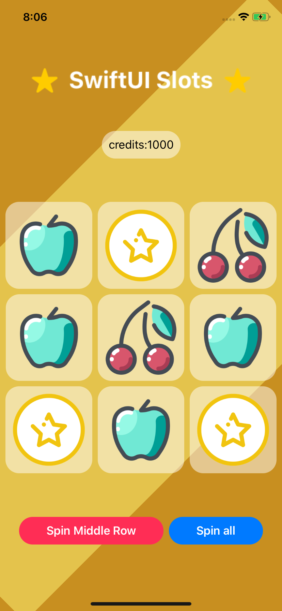
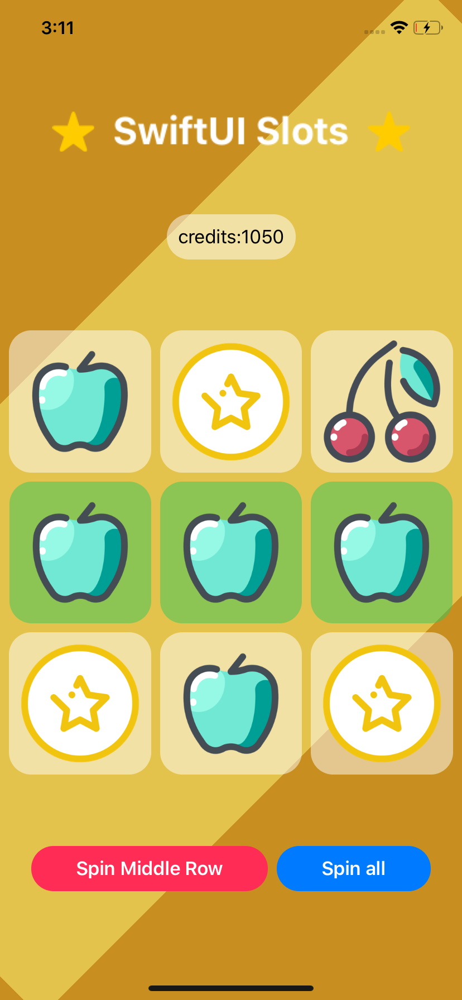
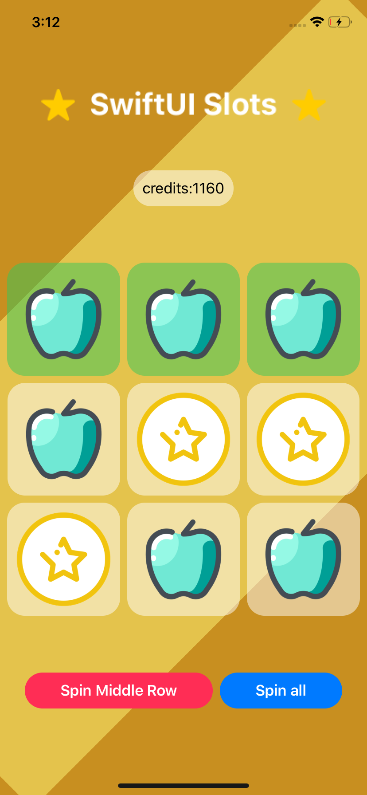
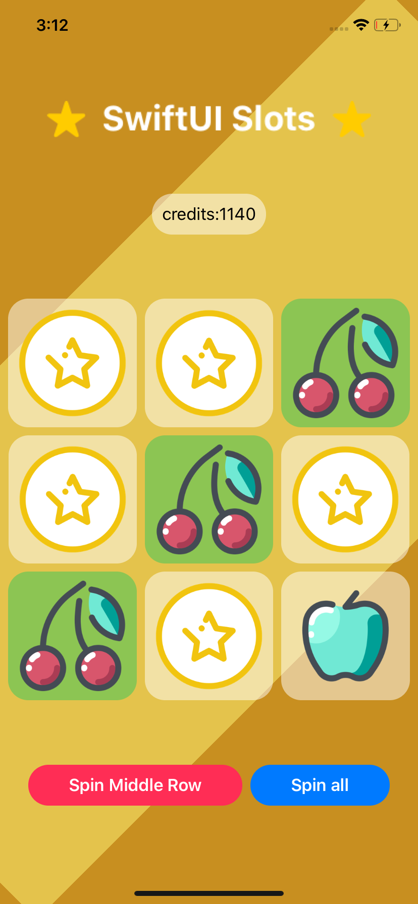

# SlotMachine

Slot Machine were your bet amount is always 10 credits. There are only two spinning options; "Spin Middle Row" or "Spin All". The "Spin Middle Row" button will make the middle row the only row to be randomized and scored. A win would result in 100 credits. The "Spin All" button will randomize every slot and score horizontal and diagonal rows. A win using the "Spin All" button would result in 20 credits.

## Getting Started

### Prerequisites

Other versions of Xcode and swift are possible to run the program. 
The following are the versions used when compiling this program:

Xcode Version: 11.5

Swift Version: 5

Targeted iOS: 13.4 iPhone and iPad

Device Orientation: Portrait, Landscape Left, Landspace Right

## Running the Game

Download all the files from this repo onto a local directory. Compile the program on Xcode.

### Example Run

SlotMachine game when starting up.

The the image below is a winning result from the “Spin Middle Row” button, which only takes into account the middle horizontal row.

The the image below is a winning result from the “Spin All” button, which takes into account all diagonal and horizontal rows.

The the image below is another winning result from the “Spin All” button.

